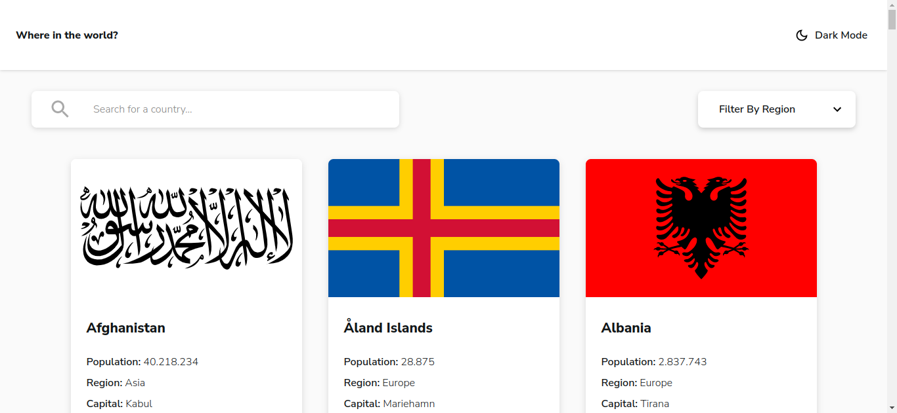
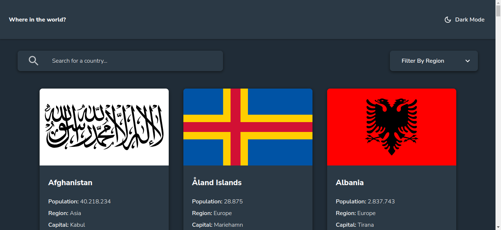
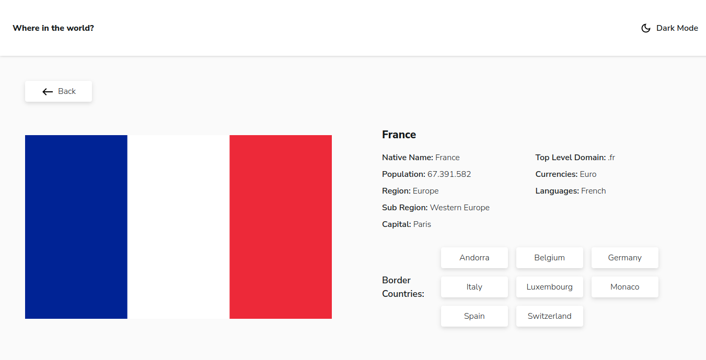
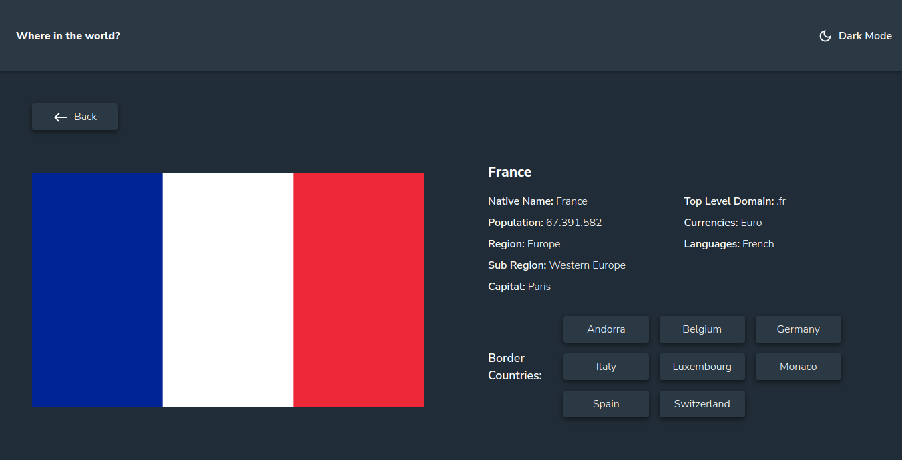
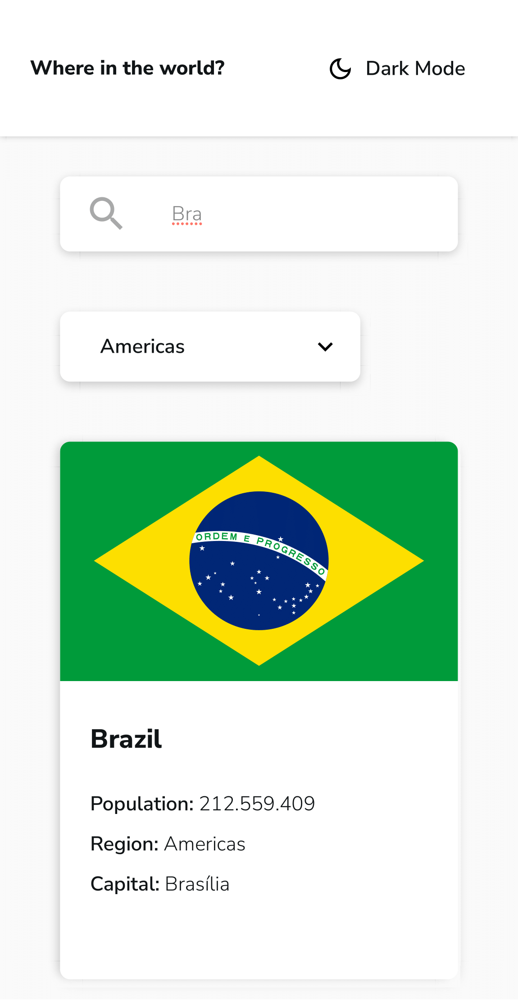
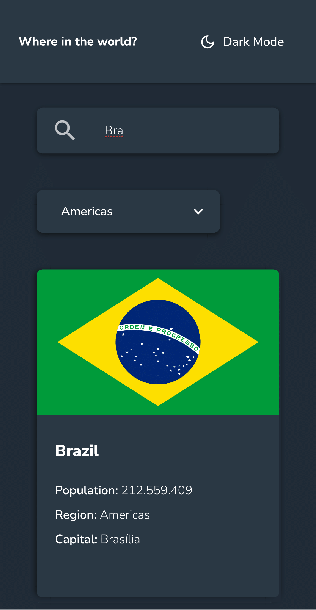
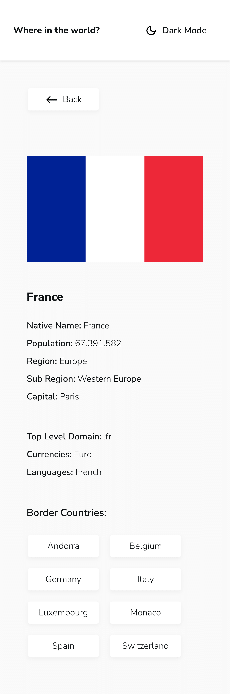
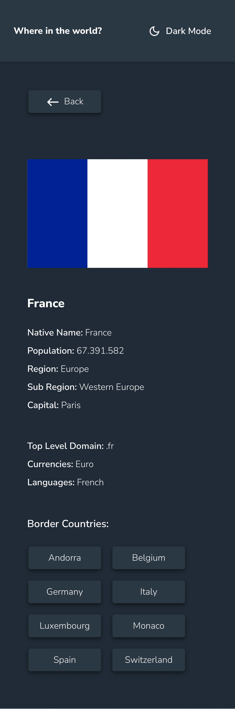

# Where in the world?

A web application that fetches and display data about all countries, with filtering capabilities.
This was made as a challenge from [Frontend Mentor](https://www.frontendmentor.io).

## Project Description

The challenge is to integrate with the [REST Countries V2 API](https://restcountries.com/#api-endpoints-v2) to pull country data and display it like in the designs provided.

The app was made with react + react-dom, react-router v5 for the routing betweem views, and Sass for styling of the components.

## Instructions

- Fork this repository
- Clone your version of the repository
- Run the following command to install the required dependencies

```
npm update
```

- Run the following command to get a local version of the app

```
npm start
```

The app can be accessed at [http://localhost:3000](http://localhost:3000)

- Use the following command to bundle the app

```
npm run build
```

It correctly bundles React in production mode and optimizes the build for the best performance.

## Live version

The app can also be acessed at its [live version URL](https://nogyure-countries-app.netlify.app/)

## Screenshots

### web






### mobile






## How to use

### Homepage

Upon loading the app at their browser, the homepage will present a list with all the countries to the user.

### Navigation

- The user can get more information about a certain country by clicking on its frame, which will rout the user to that countrie's own page.
- Being at a countrie's own page, the user can navigate to that countrie's border countries by clicking at the button-link with the desired border country name.
- If a country has no borders with other countries, it will not have border country links to navigate to.
- The user can go back to the homepage by clicking the button-link named "back" or by clicking the app's title at the header.

### Filtering

The user can search for a particular country by search term, by region or both.

#### By search term

The search by term will look for a country with the specified term within its name on a case insensitive way.

#### By region

The region filter will let the user choose which region should the countries displayed be from. It defaults to all regions.

#### By search term & region

Both filter methods are combined and the app will display only the countries with the specified term and from the specified region.

### Theme switcher

There are two themes to choose:

- Dark
- Light

The user can switch between the two by clicking the "Dark Mode" button at the header. The chosen theme will persist everytime the user access the web app.
